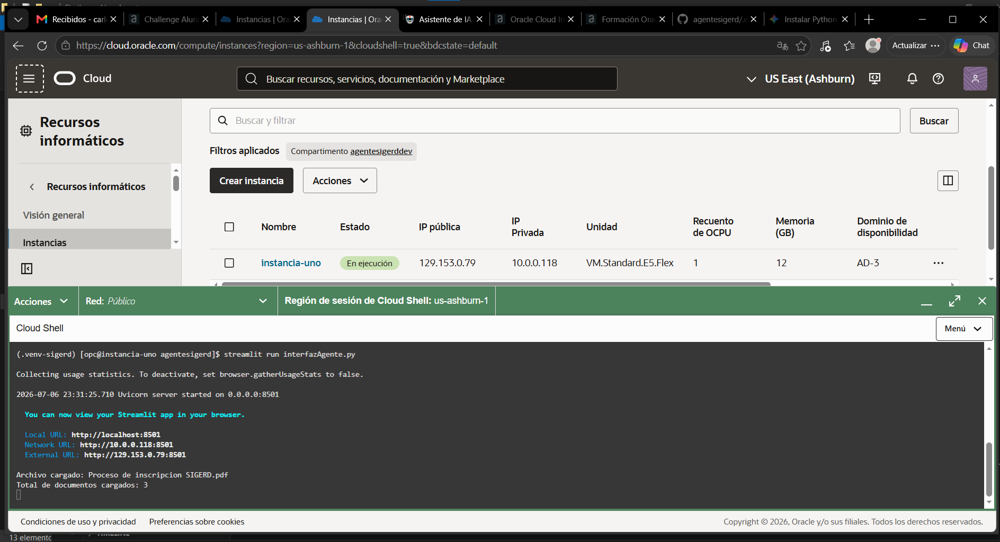
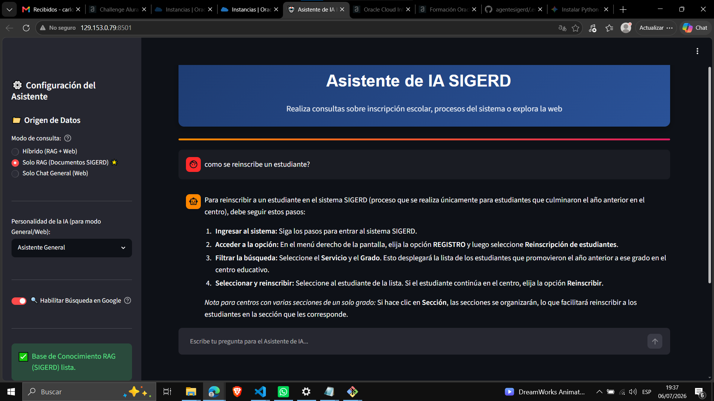

# Asistente de IA Inteligente - Sistema SIGERD

Este proyecto implementa un asistente conversacional híbrido e inteligente diseñado para el personal escolar del sistema SIGERD (Sistema de Gestión Educativa de la República Dominicana). El sistema combina un motor de generación recuperada por contexto (RAG - Retrieval-Augmented Generation) con búsqueda web en tiempo real (Google Search Grounding) mediante los modelos avanzados de Gemini 3.5 Flash.

# 🏗️ Arquitectura del Proyecto

El sistema está diseñado bajo una arquitectura desacoplada en dos módulos principales: el Motor RAG (Backend) y la Interfaz de Usuario (Frontend).

┌─────────────────────────────────────────────────────────────────────────┐
│                           INTERFAZ DE USUARIO                           │
│                      (Streamlit - interfazAgente.py)                    │
└────────────────────────────────────┬────────────────────────────────────┘
                                     │
                    ┌────────────────┴────────────────┐
                    ▼                                 ▼
         ¿Modo RAG activo?                   ¿Solo Chat General?
                    │                                 │
                    ▼                                 │
┌──────────────────────────────────────────┐          │
│                AGENTE RAG                │          │
│               (agente.py)                │          │
└───────────────────┬──────────────────────┘          │
                    │                                 │
          ¿Encontró información?                      │
             /            \                           │
          (Sí)            (No / "No lo sé")           │
           /                \                         │
          ▼                  ▼                        ▼
┌──────────────────┐   ┌──────────────────────────────────────────────────┐
│ Respuesta Directo│   │        LLAMA API GEMINI DIRECTA + GOOGLE         │
│    con Citas     │   │      (Búsqueda en Internet en tiempo real)       │
└──────────────────┘   └────────────────────────┬─────────────────────────┘
                                                │
                                                ▼
                               ┌──────────────────────────────────┐
                               │   Respuesta General + Fuentes    │
                               └──────────────────────────────────┘


## Componentes Clave:

### 1. Ingesta y Procesamiento de Documentos (agente.py):

* **Carga:** Lee dinámicamente archivos PDF ubicados en el directorio datos/ utilizando PyMuPDFLoader.

* **Segmentación (Splitting):** Divide los documentos en fragmentos de texto (chunks) de 300 caracteres con un solapamiento (overlap) de 30 caracteres usando RecursiveCharacterTextSplitter.

* **Indexación y Embeddings:** Convierte cada fragmento en vectores utilizando el modelo models/gemini-embedding-001 y crea una base de datos vectorial local con FAISS.

### 2. Caché y Optimización de Streamlit:

En Streamlit, cada acción del usuario vuelve a ejecutar todo el código. Para evitar volver a parsear y vectorizar los PDF con cada clic (lo cual sería sumamente lento y costoso), se utiliza el decorador @st.cache_resource en la función inicializar_base_conocimiento().

### 3. Orquestación de Consultas (interfazAgente.py):

**Modo Híbrido:** El usuario realiza una pregunta. Primero se consulta al RAG. Si la similitud semántica de los documentos es inferior a 0.3 (threshold) o si el modelo de lenguaje concluye con un "No lo sé", el sistema conmuta automáticamente y realiza una solicitud con Google Search Grounding para asegurar que el usuario nunca reciba una respuesta vacía.

**Modo Solo RAG:** Se limita estrictamente a la documentación interna de SIGERD.

**Modo Solo Chat:** Utiliza la personalidad seleccionada sin filtros semánticos locales.

# 🛠️ Requisitos del Sistema y Dependencias

Asegúrate de contar con Python 3.14 o superior. Las principales dependencias que dan vida al proyecto son:
```bash
streamlit==1.58.0
langchain==1.3.11
langchain-core==1.4.8
langchain-google-genai==4.2.5
langchain-community==0.4.2
langchain-text-splitters==1.1.2
google-generativeai==0.8.6
faiss-cpu==1.14.3
pymupdf==1.27.2.3
requests==2.32.5
python-dotenv==1.2.2 
```

# 🚀 Instrucciones para Ejecutar el Proyecto

### 1. Clonar o Estructurar el Repositorio

Crea la siguiente estructura de carpetas en tu entorno de desarrollo local:
```bash
mi-proyecto-sigerd/
│
├── datos/                      # Carpeta obligatoria para los manuales PDF
│   ├── Proceso_de_inscripcion_SIGERD.pdf
│   └── guia_sigerd_usuario.pdf
│
├── agente.py                   # Lógica RAG y LangChain
├── interfazAgente.py           # Interfaz de usuario Streamlit
├── api_keys.py                 # Clave API de Gemini
├── models.py                   # Constantes de modelos a utilizar
├── style.py                    # Estilos CSS premium personalizados
└── README.md                   # Esta documentación técnica
```


## 🛠️ Abrir y ejecutar el proyecto

Después de descargar el proyecto, puedes abrirlo con Visual Studio Code. A continuación, es necesario preparar tu entorno. Para ello:

### venv en Windows:

```bash
python -m venv .venv-sigerd
.\.venv-sigerd\Scripts\activate
```

### venv en Mac/Linux:

```bash
python3 -m venv .venv-sigerd
source .venv-sigerd/bin/activate
```
### 2. Instalar Dependencias
Instala los paquetes necesarios ejecutando el siguiente comando en tu terminal:
```bash
pip install -r requirements.txt
```

### 3. Configurar las Claves de Acceso y Variables

Asegúrate de que tus archivos de soporte exporten correctamente las variables necesarias:

api_keys.py:
```bash
GEMINI_API_KEY = "TU_API_KEY_DE_GEMINI_AQUÍ"
```

models.py:
```bash
GEMINI_FLASH = "gemini-2.5-flash-preview-09-2025"
```

### 4. Lanzar la Aplicación

Corra el servidor de desarrollo de Streamlit:
```bash
streamlit run interfazAgente.py
```

La aplicación se abrirá automáticamente en tu navegador web predeterminado (normalmente en http://localhost:8501).

# 💬 Ejemplos de Preguntas (Mensajes de Prueba)

## Consultas Locales de SIGERD (Modo RAG)

Estas preguntas están diseñadas para que el agente recupere directamente la información desde los PDFs dentro de la carpeta datos/:

* **Acceso:** ¿Cómo puedo acceder al sistema?

* **Búsquedas:** Quiero hacer una búsqueda de estudiante

* **Inscripción:** ¿Como inscribo un estudiante nuevo? ¿Cómo reinscribo a un estudiante?  

* **Recursos Humanos:** ¿Cómo registro un personal nuevo en SIGERD?

Consultas de Conocimiento General o fallback (Búsqueda Web Grounding)

Estas consultas forzarán al sistema (en Modo Híbrido) a consultar internet en tiempo real para traer resultados actualizados:

* ¿Quién fue Napoleon Bonaparte?

* ¿Cuáles son los requisitos de ingreso a escuelas públicas en América Latina actualmente?

* ¿Qué cambios se han anunciado en la tecnología educativa este año?

# 🛡️ Detalles Importantes y Buenas Prácticas

* **Mecanismo de Exponential Backoff:** La función call_gemini_api tiene integrado un sistema de reintentos automáticos en caso de cuellos de botella o límites de cuota (HTTP 429 / 503). Reintenta la llamada con esperas progresivas de 1s, 2s, 4s, 8s y 16s de manera silenciosa para no interrumpir la experiencia de usuario.

* **Seguridad de Metadatos:** En la interfaz, las citas extraídas de los PDF gestionan los metadatos de página (page) sumándoles 1 unidad debido a que la indexación nativa de PyMuPDF inicia en 0. Además, el sistema previene caídas si la clave de ruta de archivo (file_path o source) difiere entre sistemas operativos.

* **Directorio Vacío:** Si la carpeta datos/ está vacía al iniciar la app, el sistema no se romperá; se mostrará una advertencia interactiva en la barra lateral informando que el motor RAG está inactivo, habilitando el fallback automático a modo de consulta general.


# Captua del despliegue el Oracle OCI


